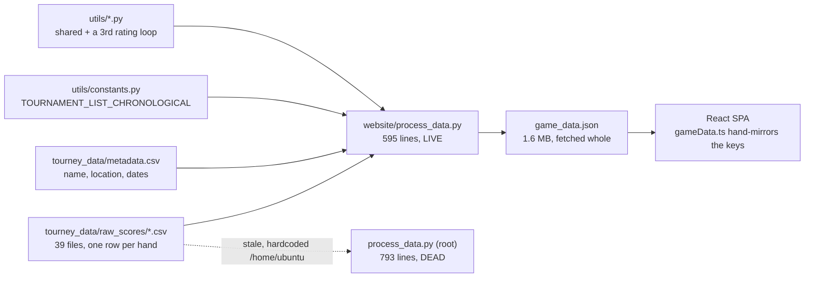
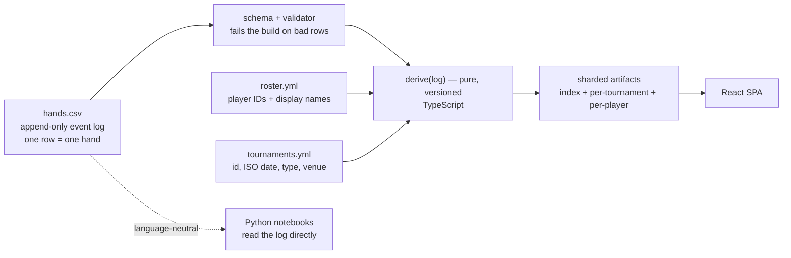
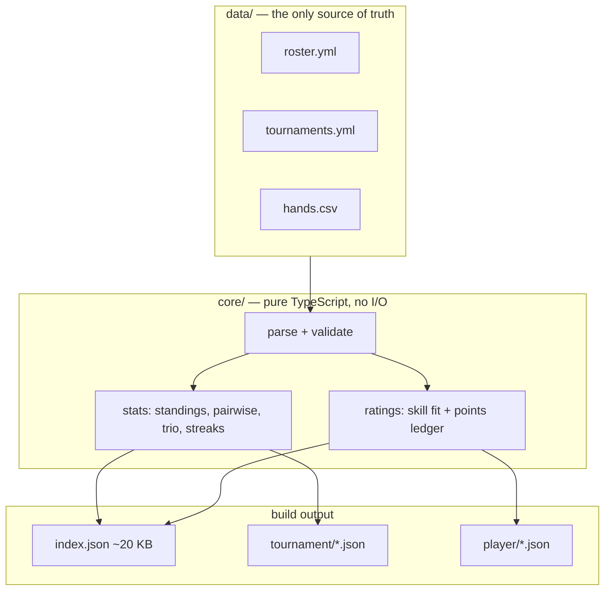
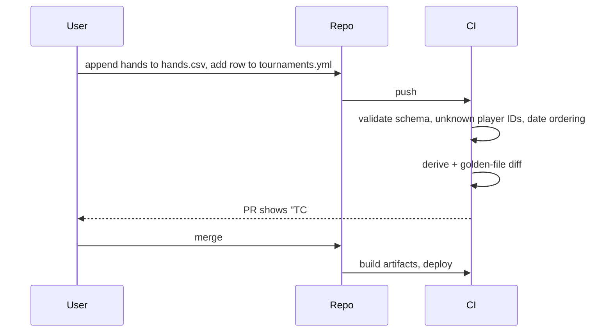
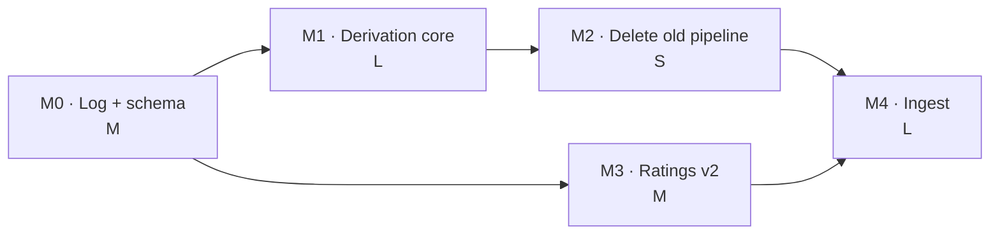

# Backend Redesign — From Scratch

Status: proposal · Branch: `claude/backend-redesign-scratch-hld02w`

## Context

The tracker holds **2,371 hands across 39 tournaments and 7 core players** — 49 KB of CSV,
9 KB gzipped. A Python pipeline (`website/process_data.py`) derives Elo, standings and
head-to-head stats into a 1.6 MB `game_data.json` that a React SPA fetches whole.

The dataset is trivially small. Everything painful about the system is **structural**, not
computational: one tournament must be registered in three places, there are three
overlapping copies of the derivation logic, there are zero tests, and the rating system is
a cumulative points ledger wearing an Elo costume.

This doc answers: *if we threw it all away and started over, what would we build?*

**Permanent non-goals:** auth, multi-tenancy, live/real-time play, a hosted database,
anything that scales past ~10⁵ hands. This is a record keeper for seven friends.

## Current State



**What's built:** the derivation math itself is correct and reasonably rich — per-hand
timeseries, pairwise/trio same-team records, bid stats, streak milestones, per-tournament
rating snapshots. The React surface is complete.

**What's missing or broken:**

| Problem | Evidence |
|---|---|
| Three registration points per tournament | CSV + `tourney_data/metadata.csv` + `utils/constants.py:79` |
| Three copies of the rating loop | `utils/ranking_system.py:53`, `website/process_data.py:286`, root `process_data.py` |
| A shim class faking a domain object | `website/process_data.py:271` `_TourneyKey` exists only to satisfy `PlayerProfile.newTournamentStart` |
| Dead code in the build path's shadow | root `process_data.py:18` hardcodes `/home/ubuntu/tourney_data`, carries a frozen list stopping at `international_friendly_4` |
| No schema, no validation | blank cell → `0` → silently "lost this hand"; a header typo silently mints a new player |
| No tests, no CI | zero test files, no `.github/workflows` |
| Payload is 17× the source data | 1.6 MB JSON from 49 KB of CSV, incl. 92 KB `tournamentSummary` that is a filtered copy of the 705 KB `tournaments` |
| Types drift by hand | pandas PascalCase leaks into `client/src/lib/gameData.ts` (`Player_x`, `TotalPoints`) |
| Identity is a string in a CSV header | `Players` enum at `utils/constants.py:11` is unused by any code path |

## Goal State



Four properties do all the work:

- **The log is the only source of truth.** Every number on the site is a pure function of it.
- **Events, not projections.** We record *what happened in the hand*, not the per-player
  score column that happens to fall out of it.
- **One language in the deploy path.** Derivation is TypeScript, so there is no
  Python↔TS type boundary to drift and no `pip install` in the Netlify build.
- **Notebooks are a consumer, not a producer.** They read the same log independently.

## Assumptions & Locked Decisions

**Locked:**

- **L1 — Flat files in git, no database.** 49 KB of source data. Git gives us history,
  review, and rollback for free. Revisit at ~10⁵ hands, i.e. never.
- **L2 — Event log replaces the score matrix.** Scores are derivable from a contract;
  a contract is not derivable from scores. `get_bid_and_won_stats` in
  `utils/data_cruncher.py:45` uses a modulo heuristic *precisely because the data was
  thrown away at write time.*
- **L3 — Player IDs, not header strings.** `roster.yml` maps stable slug → display name,
  aliases, active dates. Renaming a player stops being a data migration.
- **L4 — Chronology comes from ISO dates on tournaments, not list order.**
  `TOURNAMENT_LIST_CHRONOLOGICAL` dies. Ordering becomes data, not a hand-maintained
  Python literal whose order silently rewrites every rating.
- **L5 — Skill rating and narrative points are two different numbers.** See Low-Level Design.
- **L6 — Validation at write time, loudly.** No silent `0`-coercion, no silent new players.

**Deferred — flagged, not resolved:**

- **D1 — Ingest surface.** CLI (`3os add-hand`) vs. a phone PWA that opens a PR. Affects
  nothing upstream of it, so it is deliberately last.
- **D2 — Team-strength aggregation** for unequal team sizes (sum vs. mean). Needs a fit
  comparison on real data, not an armchair call.
- **D3 — Whether tournament-type weight survives into skill** or applies only to the ledger.

## High-Level Design

### Topology



`core/` never touches the filesystem — it takes parsed records and returns plain objects.
That single constraint is what makes the whole thing testable, and it is the property the
current pipeline most conspicuously lacks (`process_all_tournaments` reads CSVs, computes
stats, and shapes JSON output in one 130-line function).

### Flow: adding a tournament



Two files instead of three, and the PR tells you what your edit *did* to the numbers —
which today is invisible until you eyeball the site.

## Low-Level Design

### The event schema

One row per hand. This is the load-bearing decision in the whole redesign.

```
tournament_id, hand_no, bidder, bid, partners, opponents, made, tricks_or_margin, discard
tc_19,        1,        akash,  200, prateek,  nats|abhi, true, 30,               40
```

Today's per-player score columns become a *derived view*, not storage. What this buys:

- **Bid accuracy, aggression, and set rate become exact** instead of a modulo heuristic —
  and available for the whole corpus, not just the post-2024 era that happens to have a
  `Bidder` column (`championship_1.csv` has none; `mini_championship_9.csv` has
  `Bidder` + `Margin` but no `Discard`).
- **Team composition is explicit.** Today it is inferred from which scores are `> 0`,
  which is why an empty cell reads as a loss.
- **Backfill is honest.** Pre-`Bidder` tournaments get `bidder = null`. Nullable-and-known
  beats derived-and-wrong.

### Ratings: split the number in two

The current system (`utils/ranking_system.py:190`, replicated at
`website/process_data.py:286`) is:

```
winners: rating += own_points × m
losers:  rating -= min(winner_points) × m
m = (type_weight / 200) × (1 − clamp(Δrating/1000, ±0.5))
```

Four defects, all measured on the real corpus:

- **Not zero-sum.** Winners gain the sum of their points, losers collectively lose
  `n_losers × min(points)`. These are not equal. Summed over all 2,371 hands that is
  **+70,140 un-netted raw points** of drift — and the observed core-player rating total is
  7,326 against a 7,000 baseline, matching.
- **Volume-coupled.** It is a cumulative ledger, so it never converges and rewards
  attendance. The top-rated player is also the one with the most hands.
- **Order-coupled.** Ratings are produced by walking `TOURNAMENT_LIST_CHRONOLOGICAL` in
  sequence, so a mis-ordered insert silently rewrites every subsequent number.
- **No uncertainty.** A 12-hand guest sits on the same axis as a 2,000-hand regular, and
  `CORE_PLAYER_GAME_THRESHOLD = 200` (`website/process_data.py:59`) is a hard cliff that
  reshapes the leaderboard the moment a guest crosses it.

Team sizes are wildly asymmetric — 599 hands of 1-v-2 and 668 of 2-v-1, plus 4-v-1s —
so aggregation is not a detail:

| winners × losers | hands |
|---|---|
| 1 v 2 | 599 |
| 2 v 1 | 668 |
| 2 v 2 | 630 |
| 3 v 2 | 240 |
| 2 v 3 | 186 |
| 3 v 3 | 37 |
| 4 v 1 / 4 v 2 | 11 |

The replacement is **two explicitly separate numbers**:

- **Skill (μ ± σ)** — a Bradley–Terry model fitted over the *entire* log by regularized
  MLE. Each hand is one observation: team strength (aggregation per **D2**) vs. team
  strength. Order-independent by construction, converges rather than drifting, handles
  unequal team sizes natively, and yields a standard error so the UI can show `1043 ± 61`
  and stop pretending a guest's number means the same thing. 2,371 observations against
  ~9 parameters fits in milliseconds — refit on every build, no incremental state.
- **Season Points** — the fun cumulative ledger, kept for narrative ("+43 this tournament"),
  but made zero-sum by construction and labelled *points*, not *rating*.

Conflating these two is the current design's central mistake: the leaderboard wants a
story, the analysis wants a model, and one number cannot be both.

### Artifacts

`index.json` (~20 KB: roster, tournament list, standings, ratings) loads on first paint.
Per-tournament and per-player blobs load on navigation. This replaces a 1.6 MB fetch in
which 705 KB is per-hand arrays the landing page never reads.

Given the log is 9 KB gzipped, **shipping the raw log and deriving in the browser is a
live option** — it would make "re-rate with different tournament weights" an interactive
slider rather than a redeploy. Worth prototyping at M3, not worth committing to now.

## Milestones



Critical path is **M0 → M1 → M2**. M3 branches off M0 and can run in parallel.

| # | Outcome | Size | Done when |
|---|---|---|---|
| **M0** | Event log, roster, schema, validator | M | All 39 tournaments round-trip from the new log into score matrices **byte-identical** to today's CSVs, and a corrupted row fails CI with a pointed error |
| **M1** | Pure TS derivation core + golden tests | L | `derive(log)` reproduces today's `game_data.json` field-for-field for all 39 tournaments, ratings excluded |
| **M2** | Old pipeline deleted | S | Netlify build contains no `pip install`, root `process_data.py` is gone, `utils/` is notebook-only, one registration point remains |
| **M3** | Skill fit + Season Points, split in the UI | M | Shuffling log order leaves skill ratings bit-identical, every rating renders with ±σ, and the two numbers are visibly distinct |
| **M4** | Ingest surface (**D1**) | L | A hand recorded mid-game reaches `main` without anyone opening a text editor |

M2 is where the actual relief lands. M0 and M1 are the price of admission.

## Risks & Open Questions

- **Backfill gaps** — roughly half the corpus predates the `Bidder` column, so bid stats
  stay era-limited. The skill fit is unaffected (it needs only outcomes).
- **Every published number changes at M3.** Expected and intended, but it is a visible break.
- **TS rewrite orphans the notebooks** unless the log stays language-neutral. Mitigated by
  L1 + plain CSV — but it is a real constraint on the log format, not an afterthought.
- **Bradley–Terry identifiability** — 7 players with heavy co-occurrence and small
  effective sample; partner-specific effects may not be recoverable. Regularization is
  doing real work here, and σ must be honest about it.
- **Open — game rules.** The schema above assumes winners score the bid and the bidder
  takes the margin as a bonus (inferred from `bid = min(winning_points)` and
  `bid_and_won = pts > bid`). **This needs confirmation before M0 locks.**
- **Open — is `Discard` a score adjustment or metadata?** Currently it is carried but
  never read by any derivation.
- **Open — D2 and D3** above.

## Long-Term Vision

*Rough, not committed.*

- Interactive re-rating in the browser — sliders for tournament weight, era filters,
  "what if we'd never counted Tinys".
- Per-hand provenance: who recorded it, when, amendments as append-only corrections.
- Bid recommendation from historical make-rates by holding and seat.
- Retire generated notebooks (~10 MB of committed artifacts) in favour of one live notebook
  reading the log.

## Appendix — file reference

**Today:** `website/process_data.py` (live pipeline) · root `process_data.py` (dead) ·
`utils/{constants,Player,Tournament,ranking_system,data_cruncher,data_preprocessor}.py` ·
`tourney_data/{raw_scores/*.csv,metadata.csv}` · `website/client/src/lib/gameData.ts` ·
`netlify.toml`

**Proposed:** `data/{roster.yml,tournaments.yml,hands.csv}` ·
`core/{parse,stats,ratings}.ts` · `core/__tests__/golden/` · `scripts/build-artifacts.ts`
